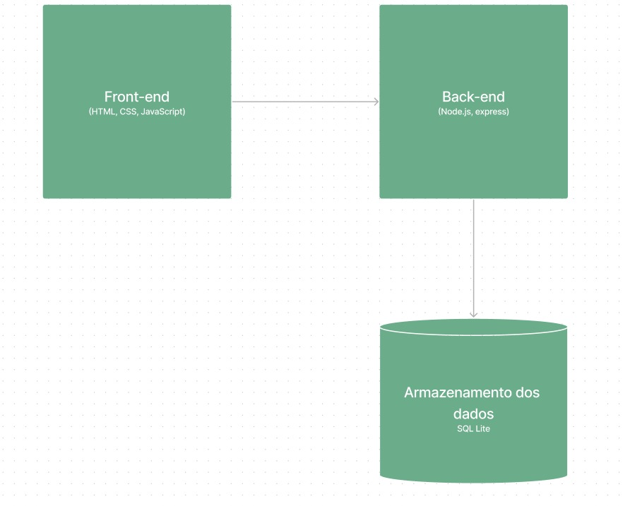
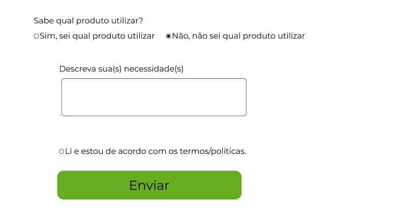

# Formulário de Interesse do Cliente

## Sobre o Projeto

Este projeto visa desenvolver um site com um formulário de interesse, para que o time de vendas da BASF possa mensurar a quantidade de clientes que precisam de ajuda na hora de escolher produtos adequados. O objetivo é coletar informações que permitirão aos nossos consultores de vendas ter uma visão melhor sobre os usuários e suas dificuldades, otimizando o processo de venda e garantindo uma melhor experiência ao cliente.

## Funcionalidades

- *Formulário de Interesse*: Uma interface simples e intuitiva para os usuários preencherem, indicando seu interesse nos produtos e a ajuda de que precisam.
- *Envio de Dados*: Após o preenchimento, os dados são enviados e armazenados em uma planilha, permitindo uma análise fácil pelos consultores de vendas.

## Tecnologias Utilizadas

- Frontend: HTML, CSS, JavaScript
- Backend: Node.js servidor express
- Dados: SQL Lite
- Hospedagem: Github pages

## Arquetetura do sistema
Ideia básica da disposição da arquitetura

## Roadmap

Plano detalhado para o desenvolvimento do formulário:

**Planejamento**
- [x] Definição de Requisitos
  - [x] Identificar campos obrigatórios e opcionais
  - [x] Definir lógica para campos condicionais
  - [x] Escolher entre planilha ou banco de dados para armazenamento

- [x] Escolha de Tecnologias
  - [x] Selecionar tecnologias de frontend (HTML, CSS, JavaScript)
  - [x] Definir tecnologia de backend (Node.js)
  - [x] Escolher o direcionamento dos dados (Database SQL Lite)

**Design**
- [x] Design do Formulário no figma

**Desenvolvimento**
- [x] Frontend
  - [x] Implementar formulário com HTML, CSS e JavaScript
  - [x] Programar lógica de campos condicionais
- [ ] Backend
  - [ ] Configurar ambiente backend
  - [ ] Implementar lógica para armazenamento de dados

**Testes**
- [x] Testes
  - [x] Realizar testes unitários e de integração
  - [x] Executar testes de usabilidade

**Lançamento**
- [x] Publicação
  - [x] Publicar formulário em servidor ou plataforma de hospedagem

**Manutenção e Atualizações**
- [ ] Feedback
  - [ ] Analisar feedback para identificar melhorias
- [ ] Atualizações
  - [ ] Implementar melhorias com base no feedback recebido

## Protótipos

Abaixo estão as imagens dos protótipos elaborados para o projeto:

### Páginas

